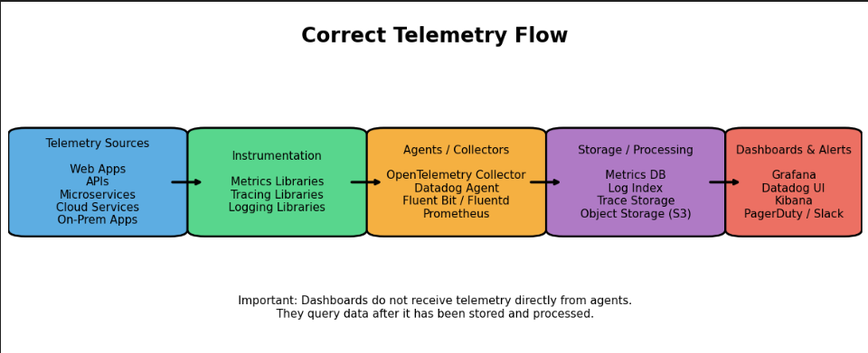

# Observability Labs with Datadog (Telemetry, Metrics, Logs, Traces)

This document summarizes the **observability concepts** discussed in this course and explains the **three labs** used to demonstrate monitoring and troubleshooting in modern DevOps environments using Datadog.

The goal of these labs is to help students understand how engineers monitor infrastructure and applications using:

- metrics
- logs
- traces
- telemetry

---

# 1. What is Observability?

**Observability** is the ability to understand the internal state of a system by analyzing the data it produces.

Modern distributed systems generate large amounts of data that help engineers answer questions such as:

- Is the system healthy?
- Why is the application slow?
- Which service failed?
- Where is latency introduced?

Observability tools analyze system telemetry and provide insights into system behavior.

---

# 2. What is Telemetry?

**Telemetry** refers to the data generated by systems and sent to monitoring platforms.

Telemetry allows engineers to observe system behavior without manually logging into servers.

Telemetry typically includes:

- Metrics
- Logs
- Traces
- Events

Telemetry Flow:

# 3. Types of Telemetry Data

## Metrics

Metrics are **numerical measurements** of system performance.

Examples:

- CPU usage
- Memory usage
- Disk utilization
- Network traffic
- Request rate
- Error rate
- API latency

Metrics help engineers track **system health and performance over time**.

Example:

CPU utilization = 75%
API latency = 120ms

---

## Logs

Logs are **text records generated by applications or systems**.

They contain detailed information about system events.

Examples:

User login successful
Database connection established
Error: payment processing failed

Logs help engineers **debug and investigate issues**.

---

## Traces

Traces show **how a request travels through different services** in a distributed system.

Example trace:

User Request
   ↓
Frontend Service
   ↓
API Service
   ↓
Database

Each step is called a **span**.

Traces help engineers identify:

- slow services
- failing dependencies
- bottlenecks in distributed systems

---

# 4. What is APM (Application Performance Monitoring)?

APM tools monitor **application performance** and provide visibility into:

- request latency
- service dependencies
- database queries
- error rates
- request throughput

Using APM, engineers can answer questions such as:

- Which service is slow?
- Which API endpoint has the highest latency?
- Which dependency is failing?

---

# 5. Monitoring Stack Used in These Labs

These labs use **Datadog** as the observability platform.

Components used in the labs:

Datadog Agent – collects telemetry data  
Application Services – generate telemetry  
Load Generator – simulates users  
Datadog Platform – visualizes metrics, logs, and traces  

Telemetry pipeline:

Application Containers
        ↓
   Datadog Agent
        ↓
    Datadog Cloud
        ↓
Dashboards / APM / Logs

---

# 6. Lab Overview

Three labs are used to progressively demonstrate observability concepts.

Lab 1 – Single API – Basic monitoring  
Lab 2 – Frontend + API + Redis – Service dependencies  
Lab 3 – Microservices chain – Distributed tracing  

---

# 7. Lab 1 – Basic Observability

Architecture:

Load Generator
      ↓
   API Service
      ↓
 Datadog Agent

Containers:

datadog-agent  
lab1-api  
lab1-loadgen  

What Lab 1 Demonstrates:

Infrastructure Monitoring  
CPU usage, memory usage, disk activity, network traffic

Container Monitoring  
container CPU, memory and network metrics

Application Performance Monitoring  
API endpoints:

/  
/slow  
/error  
/db  

Logs

home endpoint called  
slow endpoint called  
intentional error  

---

# 8. Lab 2 – Service Dependencies

Architecture:

Load Generator
      ↓
Frontend
      ↓
API
      ↓
Redis
      ↓
Datadog Agent

Containers:

datadog-agent  
lab2-frontend  
lab2-api  
lab2-redis  
lab2-loadgen  

What Lab 2 Demonstrates:

Service communication:

frontend → api → redis

Distributed tracing:

Frontend request
   ↓
API processing
   ↓
Redis query

Service Map automatically generated by Datadog.

---

# 9. Lab 3 – Microservices Observability

Architecture:

Load Generator
      ↓
Frontend
      ↓
Orders Service
      ↓
Payments Service
      ↓
Redis Database
      ↓
Datadog Agent

Containers:

datadog-agent  
lab3-frontend  
lab3-orders  
lab3-payments  
lab3-redis  
lab3-loadgen  

Distributed tracing example:

GET /checkout

frontend (20ms)
   ↓
orders (40ms)
   ↓
payments (35ms)
   ↓
redis (10ms)

Failure experiment:

docker stop lab3-payments

Result:

frontend
   ↓
orders
   ↓
payments (failed)

---

# 10. Observability Investigation Workflow

Alert triggered
      ↓
Check dashboards
      ↓
Inspect traces
      ↓
Analyze logs
      ↓
Identify root cause

---

# 11. Key Concepts Learned

After completing these labs, students should understand:

- telemetry data collection
- infrastructure monitoring
- container monitoring
- application performance monitoring
- distributed tracing
- log aggregation
- service dependency analysis
- incident investigation

These are core skills used by DevOps engineers and Site Reliability Engineers (SRE).
